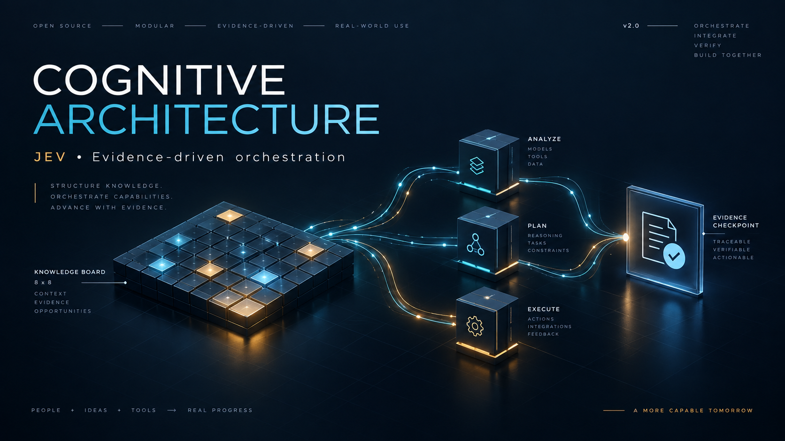
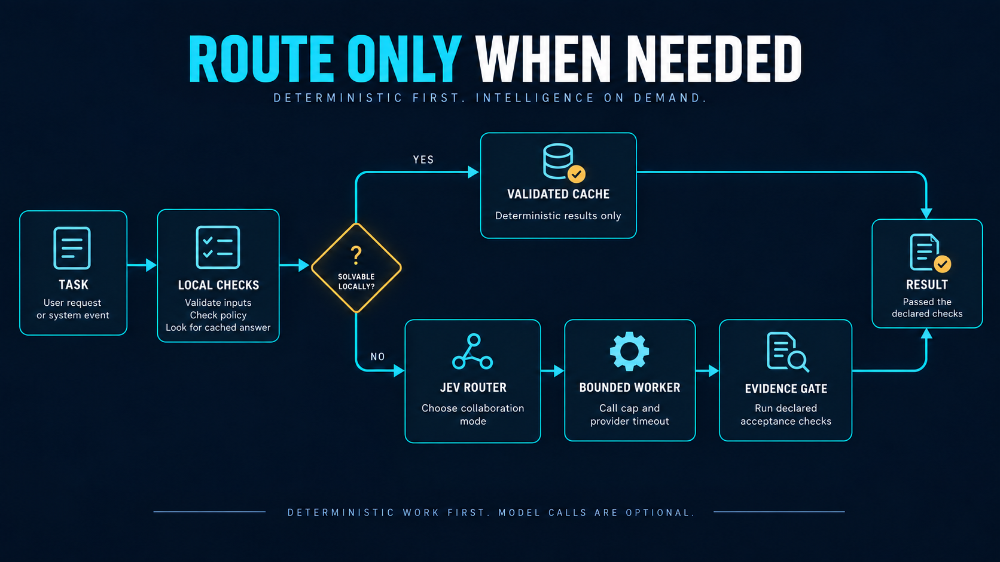
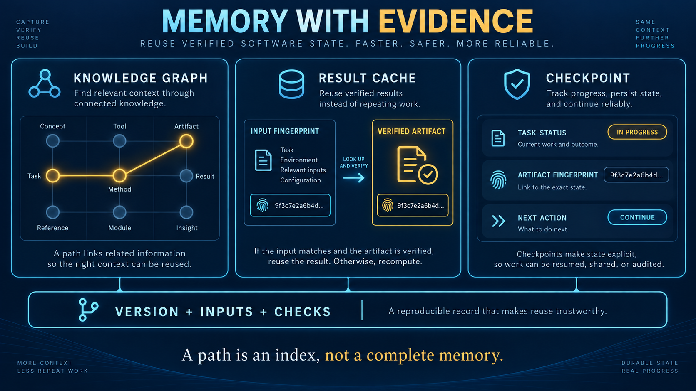
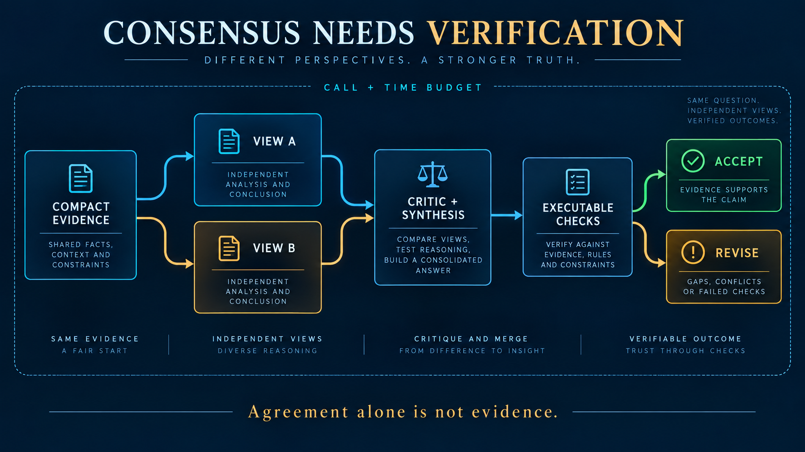

# Universal Cognitive Architecture · JEV Edition

**Executable graph workflows, deterministic reuse, and bounded model collaboration.**

[](https://github.com/Agnuxo1/Universal-Cognitive-Architecture-JEV-v2/actions/workflows/tests.yml)


[](LICENSE)

**[Guía en español](docs/GUIA_ES.md) · [Architecture](docs/ARCHITECTURE.md) · [Validation](docs/VALIDATION.md) · [Historical v1](versions/v1/README.md)**

Turn a task into a bounded, inspectable workflow: retrieve relevant graph data,
reuse a validated deterministic result, or ask JEV to choose a collaboration
mode before calling configured models. Check the exact final output against
explicit acceptance criteria and retain a small factual checkpoint.

Version 2 adds a working Python runtime to the original Chess Knowledge Graph
OS research repository. It preserves the complete Git ancestry, original HTML
and PDF artifacts, license, and a byte-identical copy of the original README.
The earlier repository remains untouched.

## Start in one minute — no credentials required

Requires Python 3.11 or later. The runtime has **no third-party dependencies**.

```bash
git clone https://github.com/Agnuxo1/Universal-Cognitive-Architecture-JEV-v2.git
cd Universal-Cognitive-Architecture-JEV-v2
python -m venv .venv
# Windows: .venv\Scripts\activate
# macOS/Linux: source .venv/bin/activate
python -m pip install -e .
python -m cognitive_architecture run examples/offline-task.json
```

The example checks a Spanish string: **24 characters, 26 UTF-8 bytes, 4 words**.
It returns `status: accepted`, two successful JSON checks, and `calls: 0`.
Run it again to obtain `cache_hit: true`; the cached output is checked again.
State is written beneath `.cognition/`, excluded from Git.

```bash
python -m cognitive_architecture graph examples/knowledge-graph.json
python -m unittest discover -s tests -v
```

## What is implemented

| Capability | Version 2 behavior |
|---|---|
| Deterministic work | SHA-256, text statistics, JSON structure summary; explicit allowlist |
| Knowledge graph | Validated directed graph, bounded breadth-first context, adjacency-checked traces |
| Result cache | Deterministic accepted results only; version/input/config key, TTL and integrity check |
| JEV routing | Optional typed choice: single worker, second opinion, thinktank, or defer |
| Model workers | Explicit Codex CLI configuration; UTF-8 input, ephemeral session, read-only sandbox |
| Collaboration | Two independent views followed by a critique/synthesis; exact synthesis is checked |
| Escalation | Configured next model only after failed acceptance checks |
| Budgets | Shared call cap including JEV; observed-token threshold and elapsed-time checks |
| Checkpoints | Atomic factual status, event names, usage and output digest; no private deliberation |



*The diagram is an overview. JEV selects collaboration, while local configuration
selects model IDs. Acceptance means the declared checks passed, not that all
claims are true. Time/token limits have the qualifications below.*

## Define a task and its acceptance criteria

```json
{
  "objective": "Measure a supplied string",
  "operation": "text_stats",
  "input": "hello world",
  "checks": [
    {"kind": "json_equals", "path": ["words"], "value": 2}
  ]
}
```

Operations: `sha256`, `text_stats`, `json_summary`, or `model`.
Checks: `nonempty`, `contains`, `excludes`, and `json_equals` with a JSON key/index
path. Unknown operations and checks are rejected before execution. These checks
are deliberately small: **a format check is not a scientific or factual validator**.
For domain verification, call `Engine` from your own tested application and
inspect the returned artifact before accepting it into a larger workflow.

## Connect JEV and Codex

Install and authenticate Codex CLI separately. Choose model IDs available to your
account; this package does not assume a universal model catalog or price list.
Copy `examples/config.example.json` to a local ignored directory and replace
its placeholder IDs. Put the least costly suitable model first, then optional
escalation tiers.

```bash
python -m cognitive_architecture run examples/model-task.json --config .cognition/config.json
```

For JEV, use `examples/config.jev.example.json` as a template. Point `connector`
to the Python executable of your **existing JEV installation** followed by
`-m jev_orchestrator.connection`; set `cwd` to that installation directory.
The connector owns authentication. No keys belong in this repository or config.
Use `collaboration: "auto"` to consult JEV. Explicit `single`, `second_opinion`,
or `thinktank` modes bypass that routing call.

The local TypeSafe connection was exercised during this release and reported
`jev-1.13.0`; this is a dated observation, not a bundled model or availability
promise. See [validation evidence](docs/VALIDATION.md).

JEV recommended event-driven consultation and an independent reviewer for this
release. **This implementation consults JEV once at initial auto routing.**
Further event-based re-routing is a future extension; failed gates currently
use the configured deterministic escalation order. JEV advice cannot waive checks.

## Memory that can be inspected



A graph node is inert data: label, content, outgoing edges, optional metadata.
The runtime does not execute Markdown, hyperlinks, graph instructions, or model
code. `--graph examples/knowledge-graph.json` adds bounded graph context to a task.

Cache identities include package version, full task inputs and checks, configured
models and limits. Corrupt, stale, or mismatched entries are recomputed. Cached
outputs must pass the current gate. Model answers are never automatically cached.

```bash
python -m cognitive_architecture status YOUR_32_CHARACTER_RUN_ID
```

Checkpoints support inspection and deliberate re-runs. They **do not automatically
resume a partially completed model panel**. Deterministic re-runs can reuse valid
cache entries; model re-runs incur new calls. Store sensitive inputs and results
locally; checkpoints themselves omit objective text and provider transcripts.

## Second opinions and thinktanks



```bash
python -m cognitive_architecture run examples/panel-task.json --config .cognition/config.json
```

Both panel modes currently use three sequential worker calls: original view,
independent view using only the original evidence, and critic/synthesis. The
configured first model handles all three; the next tier is used only if the final
synthesis fails its checks. This provides independent **calls**, not guaranteed
independent errors or distinct models. Multi-model diversity is configurable
through a custom provider; there is no automatic full-panel fan-out.

Every router/worker attempt consumes the same call budget, including failures.
The panel is not started if fewer than three worker calls remain. A failed
synthesis is never accepted merely because the two initial views passed.

## Limits, costs, and honest claims

- `max_calls` is a hard local dispatch cap. It counts subprocess invocations,
  not internal tool/model actions performed by Codex.
- `max_seconds` is checked between calls and before acceptance. Each provider
  also has its own subprocess timeout. An in-flight call may exceed the remaining
  workflow time; it will not be accepted as on-budget afterward.
- `max_observed_tokens` uses provider-reported input plus output tokens. It is
  checked between calls and after completion, so one call can overrun it. Missing
  usage is reported as unknown, never silently zero-cost. Cached-token counts are
  part of input usage, not added a second time.
- There is no monetary estimator, automatic paid API fallback, autonomous shell
  executor, publication tool, or promise of a particular token reduction.
- A graph trace indexes visited nodes. Total trace size grows with the number of
  visits; it does not encode the full evidence or reasoning. This implementation
  does not claim Turing completeness, guaranteed graph coverage, or deterministic
  replay of LLM cognition.

The original research text contains stronger theoretical claims. It is retained
for historical continuity, not presented as validation of the v2 runtime.

## Project layout

```text
src/cognitive_architecture/   Runtime, graph, providers, storage, CLI
tests/                       Offline regression tests
examples/                    Tasks, graph and provider config templates
docs/                        Architecture, Spanish guide, validation and images
versions/v1/README.md         Original research README preserved verbatim
workflow.html                Historical interactive artifact
chess10_master_suite.html    Historical application explorer
Graph Operating System.pdf   Historical research document
```

For development and private reporting see [CONTRIBUTING](CONTRIBUTING.md) and
[SECURITY](SECURITY.md). Changes are recorded in [CHANGELOG](CHANGELOG.md).

**Author:** Francisco Angulo de Lafuente. The original research credits and
collaborator attribution remain preserved in the v1 documents. License: [MIT](LICENSE).
The four README illustrations were generated with OpenAI's built-in image tool;
[prompts and provenance](docs/IMAGE_PROVENANCE.md) distinguish artwork from evidence.
